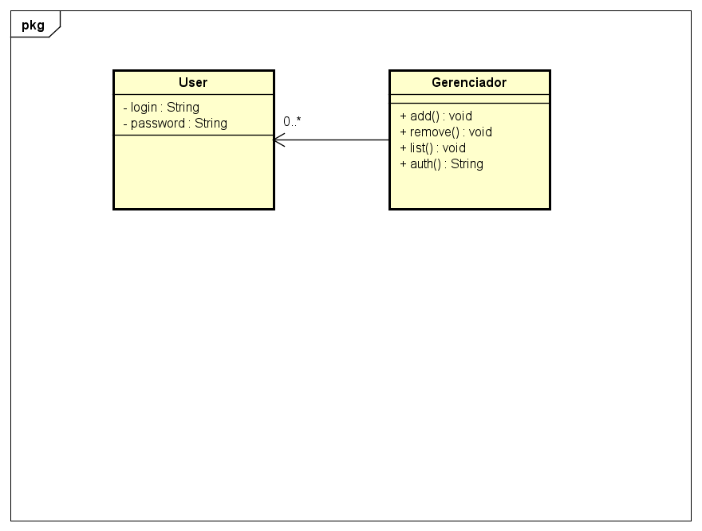
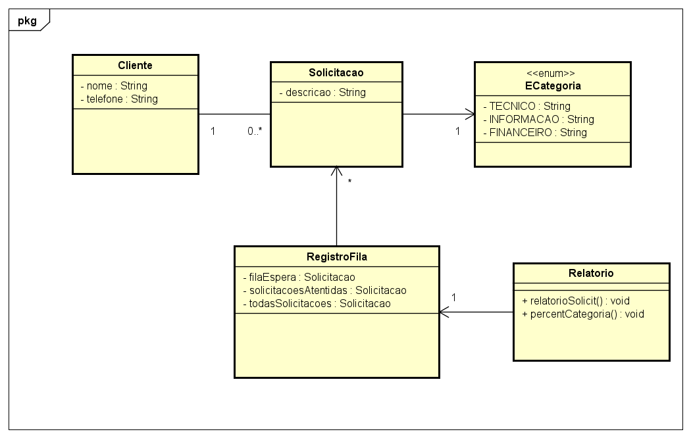
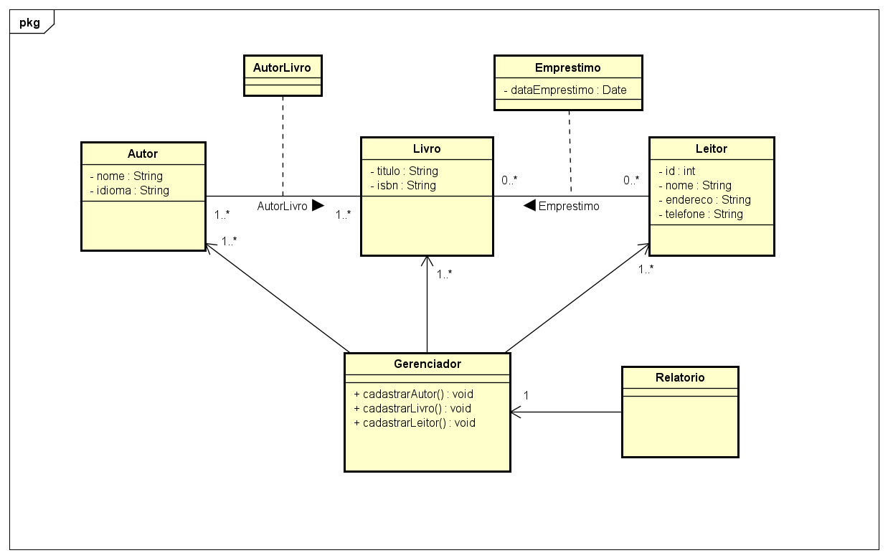

# Lista 3 POO - Diagrama de classes

por: Germano D. Coelho

## Introdução

Este repositório é destinado a lista 3 de Programação Orientada a Objetos, onde contempla a introdução aos conceitos de diagrama de classes, asscociações e linguagem UML.

A lista está dividida em três exercícios para exercita e implementar esses conceitos.

## Sistema de Login

Este exercício consiste em uma aplicação Web onde é necessário fazer o gerenciamento de logins e senha dos usuários.

### Requisitos Funcionais
* Cadastrar novos usuários a partir de login e senha, garantindo que logins não se repitam.
* Remover usuários com base em seu login.
* Listar os logins de todos os usuários cadastrados, preservando a ordem de cadastro.
* Autenticar usuários, verificando se login e senha correspondem a um usuário existente

 Diagrama de classe abaixo:
 

 ## Fila de Atendimento

Este exercício consiste em um sistema de atendimento de clientes de uma organização, onde é necessário registrar as solicitações e seus tipos em uma fila de atendimento.

### Requisitos Funcionais
* Registrar novas solicitações de atendimento, vinculadas ao nome e telefone do cliente.
* Listar os telefones de todos os clientes já registrados.
* Imprimir o nome do próximo cliente da fila.
* Atender o próximo cliente da fila.
* Listar os nomes dos clientes já atendidos.
* Listar os telefones dos clientes ainda em espera.
* Gerar relatório estatístico contendo:
  * Total de solicitações registradas, atendidas e em espera.
  * Distribuição percentual das solicitações por categoria.

 Diagrama de classe abaixo:
 

 ## Biblioteca de Livros

Este exercício consiste em um sistema de gerenciamento de uma biblioteca, onde faça-se necessário o controle e registro de livros, empréstimos e leitores.

### Requisitos Funcionais
* Cadastrar autores, livros e leitores.
* Registrar empréstimos de livros para leitores, desde que:
  * Haja pelo menos uma cópia disponível do livro.
  * O leitor ainda não tenha esse livro emprestado.
  * O leitor possua menos de 5 livros emprestados.
* Listar dados da biblioteca, incluindo:
  * Autores, em ordem alfabética.
  * Leitores, em ordem alfabética e por id.
  * Livros, ordenados por título, por autor e por ISBN.
  * Empréstimos, por data.
  * Empréstimos de um leitor específico, por data.

 Diagrama de classe abaixo:

 

